# Lista de Exercícios — Prova 1 (Grafos)

## Conceitos Iniciais

### Exercício 1 — Desenhe os grafos

**1a)** V = {1,2,3,4,5}, E = {(1,2),(1,4),(1,5),(2,3),(3,4),(4,4)}

**1b)** V = {1,2,3,4,5,6}, E = {(1,2),(1,4),(1,4),(2,3),(2,5),(3,5)}

---

### Exercício 2 — Desenhe os grafos

**2a)** K₃,₃ — bipartido completo com X = {1,5,6} e Y = {2,3,4}; E = {(1,2),(1,3),(1,4),(2,5),(2,6),(3,5),(3,6),(4,5),(4,6)}

**2b)** Grafo simples, não bipartido (contém triângulo 2-3-4); E = {(1,2),(1,4),(2,3),(2,4),(2,5),(3,4),(3,5)}

---

### Exercício 3 — Identificar grafos simples e classificá-los

**Grafo 1a:** possui laço (4,4) → **não é simples**.

**Grafo 1b:** possui arestas múltiplas (dois (1,4)) → **não é simples**.

**Grafo 2a:** simples. Com X = {1, 5, 6} e Y = {2, 3, 4}, todo vértice de X se conecta a todo vértice de Y (cada um com grau 3), totalizando 9 arestas = 3 × 3. Logo o grafo é **K₃,₃ — bipartido completo**.

**Grafo 2b:** simples. Contém o triângulo 2-3-4 (ciclo de comprimento 3, ímpar), logo **não é bipartido**.

---

### Exercício 13 — Número de arestas em Kₙ

Em Kₙ todo par de vértices distintos é ligado por exatamente uma aresta. O número de pares é:

$$|E(K_n)| = \binom{n}{2} = \frac{n(n-1)}{2}$$

---

### Exercício 15 — Teorema 1.1 (Soma dos graus = 2|E|)

**Prova:** Cada aresta {u, v} contribui exatamente 1 para o grau de u e 1 para o grau de v, totalizando 2 contribuições. Somando sobre todas as arestas:

$$\sum_{v \in V} d(v) = \sum_{e \in E} 2 = 2|E| \qquad \blacksquare$$

---

### Exercício 16 — Tamanho de Kₙ e Kₘ,ₙ pelo Teorema 1.1

**Kₙ:** todo vértice tem grau n−1, então a soma dos graus é n(n−1). Pelo Teorema 1.1:

$$2|E| = n(n-1) \implies |E(K_n)| = \frac{n(n-1)}{2}$$

**Kₘ,ₙ:** no bipartido completo, cada vértice do conjunto X (|X|=m) tem grau n, e cada vértice de Y (|Y|=n) tem grau m. Soma dos graus = mn + nm = 2mn. Logo:

$$2|E| = 2mn \implies |E(K_{m,n})| = mn$$

---

### Exercício 17 — Teorema 1.2 (Número par de vértices de grau ímpar)

**Prova:** Pelo Teorema 1.1, $\sum_{v \in V} d(v) = 2|E|$, que é par. Separe os vértices em dois conjuntos: I (grau ímpar) e P (grau par). Então:

$$\underbrace{\sum_{v \in P} d(v)}_{\text{par}} + \sum_{v \in I} d(v) = 2|E| \text{ (par)}$$

Logo $\sum_{v \in I} d(v)$ é par. Como cada parcela é ímpar, a soma de ímpares só é par se a quantidade de parcelas for par. Portanto |I| é par. $\blacksquare$

---

### Exercício 25 — Dois grafos cúbicos não isomorfos com 6 vértices

Um grafo cúbico tem todos os vértices com grau 3. Com 6 vértices a soma dos graus é 18, logo 9 arestas.

Os dois grafos são 3-regulares e não isomorfos porque **K₃,₃** não possui triângulos (é bipartido), enquanto o **prisma triangular** contém triângulos.

---

### Exercício 29 — Pontes de Königsberg

**a) Grafo:** quatro vértices (A, B, C, D) representando as massas de terra; sete arestas representando as pontes.
D é a ilha central (grau 5); A e B são as margens norte e sul (grau 3 cada); C é a margem oeste (grau 3).
Arestas: A–D (×2), B–D (×2), C–D, A–C, B–C.

**b) Graus:** d(A) = 3, d(B) = 3, d(C) = 3, d(D) = 5.

Verificação: 3 + 3 + 3 + 5 = 14 = 2 × 7 ✓

**c)** Pelo Teorema de Euler, um grafo possui **circuito euleriano** (percurso que passa por cada aresta exatamente uma vez e retorna ao ponto de partida) se e somente se **todos os vértices têm grau par**. Aqui todos os quatro vértices têm grau ímpar, portanto **não existe tal percurso**.

---

### Exercício 30 — Multigrafo com laço e arestas paralelas

**a)** V = {a, b, c}, arestas: {a,b}, {a,b}, {b,c}, {a,a}

**b) Graus:**
- d(a) = 2 (laço conta 2) + 2 (duas arestas para b) = **4**
- d(b) = 2 (duas arestas para a) + 1 (aresta para c) = **3**
- d(c) = **1**

**c)** Não é simples: possui laço {a,a} e arestas múltiplas ({a,b} aparece duas vezes).

---

## Grafos Planares

### Exercício 44 — Três casas e três serviços

**a)** O grafo é bipartido completo **K₃,₃** (3 casas × 3 serviços, todas as conexões).

**b)** Para um grafo simples, conexo e planar sem triângulos, vale m ≤ 2n − 4. K₃,₃ tem n = 6, m = 9. Verificando: 2 × 6 − 4 = 8 < 9. A desigualdade é **violada**, logo K₃,₃ **não é planar**.

**c)** K₃,₃ é um grafo bipartido (sem triângulos), portanto toda face teria grau ≥ 4. Pela Fórmula de Euler f = m − n + 2 = 9 − 6 + 2 = 5. Mas a soma dos graus das faces = 2m = 18, e com 5 faces cada uma teria grau médio 18/5 = 3,6 < 4 — contradição. É matematicamente impossível instalar os cabos sem cruzamentos.

---

### Exercício 45 — Desigualdades de planaridade

**a) Prova de m ≤ 3n − 6:**

Em um grafo planar simples e conexo com n ≥ 3, toda face tem grau ≥ 3 (pois não há arestas múltiplas). A soma dos graus das faces é 2m (cada aresta borda exatamente 2 faces). Assim: 2m ≥ 3f, logo f ≤ 2m/3. Pela Fórmula de Euler f = m − n + 2, então:

$$m - n + 2 \leq \frac{2m}{3} \implies 3m - 3n + 6 \leq 2m \implies m \leq 3n - 6 \qquad \blacksquare$$

**b) Prova de m ≤ 2n − 4 (sem triângulos):**

Se G não possui triângulos, toda face tem grau ≥ 4. Logo 2m ≥ 4f, ou seja f ≤ m/2. Usando Euler:

$$m - n + 2 \leq \frac{m}{2} \implies 2m - 2n + 4 \leq m \implies m \leq 2n - 4 \qquad \blacksquare$$

**c)** A igualdade em (a) é atingida por qualquer **grafo maximal planar** (triangulação), por exemplo K₄ (n = 4, m = 6 = 3 × 4 − 6). A igualdade em (b) é atingida pelo grafo **Q₃** (cubo): para Q₃, n = 8, m = 12 = 2 × 8 − 4 ✓.

---

### Exercício 47 — Grafo planar com 7 vértices

**a)** Usando m ≤ 3n − 6 com n = 7:

$$m \leq 3 \times 7 - 6 = \mathbf{15} \text{ arestas}$$

**b)** Um grafo maximal planar com 7 vértices (triangulação) atinge esse máximo. Exemplo: K₄ mais 3 vértices inseridos em faces, conectados a todos os vértices daquela face.

**c)** Sim, é **maximal planar**: adicionar qualquer nova aresta violaria a desigualdade m ≤ 3n − 6 (m passaria a 16 > 15) ou criaria cruzamento, tornando o grafo não planar.

---

### Exercício 48 — Grafo planar sem triângulos com 8 vértices

**a)** Usando m ≤ 2n − 4 com n = 8:

$$m \leq 2 \times 8 - 4 = \mathbf{12} \text{ arestas}$$

**b)** O **cubo Q₃** (grafo hipercubo 3-dimensional) é bipartido (logo sem triângulos), planar, com 8 vértices e exatamente 12 arestas — atinge o máximo.

**c)** Pela Fórmula de Euler:

$$f = m - n + 2 = 12 - 8 + 2 = \mathbf{6} \text{ faces}$$

Verificação: soma dos graus das faces = 2 × 12 = 24 = 4 × 6 (cada face é um quadrado) ✓

---

### Exercício 51 — Rede de ruas com 12 cruzamentos

**a)** Com n = 12, pela desigualdade de planaridade:

$$m \leq 3 \times 12 - 6 = \mathbf{30} \text{ ruas no máximo}$$

**b)** Com 32 ruas e n = 12: 32 > 30, a desigualdade é violada. O projeto com 32 ruas **não é possível** de forma planar — seria necessário ao menos um viaduto ou túnel.

**c)** Sem triângulos (grafo *triangle-free*), aplica-se m ≤ 2n − 4:

$$m \leq 2 \times 12 - 4 = \mathbf{20} \text{ ruas no máximo}$$
